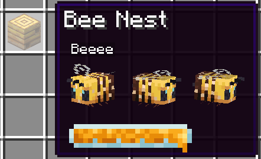

# Advanced Tooltips
[](https://www.curseforge.com/minecraft/mc-mods/advanced-tooltips)
[](https://www.curseforge.com/minecraft/mc-mods/advanced-tooltips)
[![Modrinth downloads](https://img.shields.io/badge/dynamic/json?color=5da545&label=modrinth&prefix=downloads%20&query=downloads&url=https://api.modrinth.com/api/v1/mod/advanced-tooltips&style=flat&logo=data:image/svg+xml;base64,PHN2ZyB4bWxucz0iaHR0cDovL3d3dy53My5vcmcvMjAwMC9zdmciIHZpZXdCb3g9IjAgMCAxMSAxMSIgd2lkdGg9IjE0LjY2NyIgaGVpZ2h0PSIxNC42NjciICB4bWxuczp2PSJodHRwczovL3ZlY3RhLmlvL25hbm8iPjxkZWZzPjxjbGlwUGF0aCBpZD0iQSI+PHBhdGggZD0iTTAgMGgxMXYxMUgweiIvPjwvY2xpcFBhdGg+PC9kZWZzPjxnIGNsaXAtcGF0aD0idXJsKCNBKSI+PHBhdGggZD0iTTEuMzA5IDcuODU3YTQuNjQgNC42NCAwIDAgMS0uNDYxLTEuMDYzSDBDLjU5MSA5LjIwNiAyLjc5NiAxMSA1LjQyMiAxMWMxLjk4MSAwIDMuNzIyLTEuMDIgNC43MTEtMi41NTZoMGwtLjc1LS4zNDVjLS44NTQgMS4yNjEtMi4zMSAyLjA5Mi0zLjk2MSAyLjA5MmE0Ljc4IDQuNzggMCAwIDEtMy4wMDUtMS4wNTVsMS44MDktMS40NzQuOTg0Ljg0NyAxLjkwNS0xLjAwM0w4LjE3NCA1LjgybC0uMzg0LS43ODYtMS4xMTYuNjM1LS41MTYuNjk0LS42MjYuMjM2LS44NzMtLjM4N2gwbC0uMjEzLS45MS4zNTUtLjU2Ljc4Ny0uMzcuODQ1LS45NTktLjcwMi0uNTEtMS44NzQuNzEzLTEuMzYyIDEuNjUxLjY0NSAxLjA5OC0xLjgzMSAxLjQ5MnptOS42MTQtMS40NEE1LjQ0IDUuNDQgMCAwIDAgMTEgNS41QzExIDIuNDY0IDguNTAxIDAgNS40MjIgMCAyLjc5NiAwIC41OTEgMS43OTQgMCA0LjIwNmguODQ4QzEuNDE5IDIuMjQ1IDMuMjUyLjgwOSA1LjQyMi44MDljMi42MjYgMCA0Ljc1OCAyLjEwMiA0Ljc1OCA0LjY5MSAwIC4xOS0uMDEyLjM3Ni0uMDM0LjU2bC43NzcuMzU3aDB6IiBmaWxsLXJ1bGU9ImV2ZW5vZGQiIGZpbGw9IiM1ZGE0MjYiLz48L2c+PC9zdmc+)](https://modrinth.com/mod/advanced-tooltips)

[](https://discord.gg/6bTGYFppfz)

More and better tooltips on items!

## What is this mod?
**Advanced Tooltips** adds new tooltips to items like shulker boxes, filled maps, fish buckets, armor, food, banner patterns, and more! It's is also pretty configurable, most parts can be enabled/disabled to your heart's desire!

This is a Fabric port of the now Quilt-exclusive mod "Inspecio", found [here](https://www.curseforge.com/minecraft/mc-mods/inspecio).


## Pictures

#### Armor tooltip


#### Food tooltip


#### Effects tooltips


#### Shulker Box tooltips (and other storage blocks)
Normal:


Colored:


Compact:


#### Jukebox tooltip


#### Loot Table Tooltip


#### Bee Hive Tooltip



#### Sign Tooltip


#### Banner Pattern


#### Campfire


#### Filled Map


#### Entities

##### Armor Stand


##### Bucket of Fish


##### Bucket of Axolotl


##### Spawn Eggs


#### Lodestone Compass


#### Repair Cost


## Configuration
The configuration file of the mod is located in `<minecraft directory>/config/advanced-tooltips.json`.

You can use the command `/tooltips config` to manage configuration.

Here's the default configuration:

```json
{
  "jukebox": "fancy",
  "sign": "fancy",
  "advanced_tooltips": {
    "repair_cost": true,
    "lodestone_coords": false
  },
  "filled_map": {
    "enabled": true,
    "show_player_icon": false
  },
  "food": {
    "hunger": true,
    "saturation": "merged"
  },
  "containers": {
    "campfire": true,
    "storage": {
      "enabled": true,
      "compact": false,
      "loot_table": true
    },
    "shulker_box": {
      "enabled": true,
      "compact": false,
      "loot_table": true,
      "color": true
    }
  },
  "effects": {
    "food": true,
    "hidden_motion": true,
    "hidden_effect_mode": "enchantment",
    "beacon": true,
    "potions": true,
    "tipped_arrows": true,
    "spectral_arrow": true
  },
  "entities": {
    "fish_bucket": {
      "enabled": true,
      "always_show_name": false,
      "spin": true
    },
    "spawn_egg": {
      "enabled": true,
      "always_show_name": false,
      "spin": true
    },
    "pufferfish_puff_state": 2,
    "armor_stand": {
      "enabled": true,
      "always_show_name": false,
      "spin": true
    },
    "bee": {
      "enabled": true,
      "always_show_name": false,
      "spin": true,
      "show_honey_level": true
    },
    "mob_spawner": {
      "enabled": true,
      "always_show_name": false,
      "spin": true
    }
  },
  "armor": true,
  "banner_pattern": true
}
```

Here's a list of each configuration entries and what they do:

 - `armor` (`bool`) - `true` if the display of the armor bar on armor items is enabled, or `false` otherwise.
 - `banner_pattern` (`bool`) - `true` if the display of the pattern in the tooltip of banner patterns is enabled, or `false` otherwise.
 - `advanced_tooltips`
   - `repair_cost` (`bool`) - `true` if the display the repair cost value is enabled, or `false` otherwise.
   - `lodestone_coords` (`bool`) - `true` if a display of the lodestone coordinates on lodestone compass is enabled, or `false` otherwise.
 - `containers`
   - `campfire` (`bool`) - `true` if the display of a special tooltip on campfires which hold custom NBT is enabled, or `false` otherwise.
   - `storage`
     - `enabled` (`bool`) - `true` if the inventory of storage items like chests, barrels, etc. should be shown in the tooltip, or `false` otherwise.
     - `compact` (`bool`) - `true` if the inventory should be compacted to take as little space as possible, or `false` otherwise.
     - `loot_table` (`bool`) - `true` if the loot table identifier should be displayed in the tooltip if specified, or `false` otherwise.
   - `shulker_box`
     - `enabled` (`bool`) - `true` if the inventory of shulker boxes should be shown in the tooltip, or `false` otherwise.
     - `compact` (`bool`) - `true` if the inventory should be compacted to take as little space as possible, or `false` otherwise.
     - `loot_table` (`bool`) - `true` if the loot table identifier should be displayed in the tooltip if specified, or `false` otherwise.
     - `color` (`bool`) - `true` if the inventory tooltip should be colored the same as the shulker box, or `false` otherwise.
 - `effects`
   - `potions` (`bool`) - `true` if replacing the effect tooltips with a fancy one on potion items is enabled, or `false` otherwise.
   - `tipped_arrows` (`bool`) - `true` if replacing the effect tooltips with a fancy one on tipped arrows is enabled, or `false` otherwise.
   - `spectral_arrow` (`bool`) - `true` if replacing the effect tooltips with a fancy one on spectral arrow item is enabled, or `false` otherwise.
   - `food` (`bool`) - `true` if adding effect tooltips on food items is enabled, or `false` otherwise.
   - `hidden_motion` (`bool`) - `true` if using obfuscated text for hidden effect tooltips is enabled, or `false` otherwise.
   - `hidden_effect_mode` (`string`) - `"enchantment"` will display the obfuscated text for hidden effect tooltips with the enchantment font, `"obfuscated"` will use the normal font.
   - `beacon` (`bool`) - `true` if adding a tooltip with the primary and secondary effects (if they exist) is enabled, or `false` otherwise.
 - `entities`
   - `armor_stand`
      - `enabled` (`bool`) - `true` if armor stand tooltip should be displayed, or `false` otherwise.
      - `always_show_name` (`bool`) - `true` if the name of an armor stand should always be shown, or `false` otherwise and use the CTRL key instead.
      - `spin` (`bool`) - `true` if the armor stand spin in the tooltip, or `false` otherwise
   - `bee`
     - `enabled` (`bool`) - `true` if displaying the bees in the beehive tooltip is enabled, or `false` otherwise.
     - `always_show_name` (`bool`) - `true` if the name of the bees should always be shown, or `false` otherwise and use the CTRL key instead.
     - `spin` (`bool`) - `true` if the bees spin in the tooltip, or `false` otherwise.
     - `show_honey_level` (`bool`) `true` if the honey level should be shown, or `false` otherwise.
   - `fish_bucket`
     - `enabled` (`bool`) - `true` if fish bucket tooltips should display the entity they hold, or `false` otherwise.
     - `spin` (`bool`) - `true` if the entity spins in the tooltip, or `false` otherwise.
   - `mob_spawner`
     - `enabled` (`bool`) - `true` if mob spawner tooltips should display the entity they hold, or `false` otherwise.
     - `always_show_name` (`bool`) - `true` if the name of the hold entity should always be shown, or `false` otherwise.
     - `spin` (`bool`) - `true` if the entity spins in the tooltip, or `false` otherwise.
   - `spawn_egg`
     - `enabled` (`bool`) - `true` if spawn egg tooltips should display the entity they hold, or `false` otherwise.
     - `always_show_name` (`bool`) - `true` if the name of the hold entity should always be shown, or `false` otherwise.
     - `spin` (`bool`) - `true` if the entity spins in the tooltip, or `false` otherwise.
   - `pufferfish_puff_state` (`int`) - the pufferfish puff state, between 0 and 2 inclusive.
 - `filled_map`
   - `enabled` (`bool`) - `true` if filled map tooltips should display the map, or `false` otherwise.
   - `show_player_icon` (`bool`) - `true` if show the player icon on filled map tooltips, or `false` otherwise.
 - `food`
   - `hunger` (`bool`) - `true` if hunger bar should be displayed on food items, or `false` otherwise.
   - `saturation` (`string`) - `"disabled"` does nothing, `"merged"` adds the saturation bar as an outline to the hunger bar, `"separated"` adds its own saturation bar.
 - `jukebox` (`string`) - `"disabled"` does nothing, `"fast"` will add the inserted disc name if possible in the tooltip of jukeboxes, `"fancy"` will display the disc item as well.
 - `sign` (`string`) - `"disabled"` does nothing, `"fast"` will add the sign content as text tooltip if possible, `"fancy"` will add a fancy sign tooltip if possible.

[fabric]: https://fabricmc.net
[Mod loader: Fabric]: https://img.shields.io/badge/modloader-Fabric-1976d2?style=flat-square&logo=data:image/png;base64,iVBORw0KGgoAAAANSUhEUgAAACAAAAAgCAYAAABzenr0AAAACXBIWXMAAAsTAAALEwEAmpwYAAAFHGlUWHRYTUw6Y29tLmFkb2JlLnhtcAAAAAAAPD94cGFja2V0IGJlZ2luPSLvu78iIGlkPSJXNU0wTXBDZWhpSHpyZVN6TlRjemtjOWQiPz4gPHg6eG1wbWV0YSB4bWxuczp4PSJhZG9iZTpuczptZXRhLyIgeDp4bXB0az0iQWRvYmUgWE1QIENvcmUgNS42LWMxNDIgNzkuMTYwOTI0LCAyMDE3LzA3LzEzLTAxOjA2OjM5ICAgICAgICAiPiA8cmRmOlJERiB4bWxuczpyZGY9Imh0dHA6Ly93d3cudzMub3JnLzE5OTkvMDIvMjItcmRmLXN5bnRheC1ucyMiPiA8cmRmOkRlc2NyaXB0aW9uIHJkZjphYm91dD0iIiB4bWxuczp4bXA9Imh0dHA6Ly9ucy5hZG9iZS5jb20veGFwLzEuMC8iIHhtbG5zOmRjPSJodHRwOi8vcHVybC5vcmcvZGMvZWxlbWVudHMvMS4xLyIgeG1sbnM6cGhvdG9zaG9wPSJodHRwOi8vbnMuYWRvYmUuY29tL3Bob3Rvc2hvcC8xLjAvIiB4bWxuczp4bXBNTT0iaHR0cDovL25zLmFkb2JlLmNvbS94YXAvMS4wL21tLyIgeG1sbnM6c3RFdnQ9Imh0dHA6Ly9ucy5hZG9iZS5jb20veGFwLzEuMC9zVHlwZS9SZXNvdXJjZUV2ZW50IyIgeG1wOkNyZWF0b3JUb29sPSJBZG9iZSBQaG90b3Nob3AgQ0MgMjAxOCAoV2luZG93cykiIHhtcDpDcmVhdGVEYXRlPSIyMDE4LTEyLTE2VDE2OjU0OjE3LTA4OjAwIiB4bXA6TW9kaWZ5RGF0ZT0iMjAxOS0wNy0yOFQyMToxNzo0OC0wNzowMCIgeG1wOk1ldGFkYXRhRGF0ZT0iMjAxOS0wNy0yOFQyMToxNzo0OC0wNzowMCIgZGM6Zm9ybWF0PSJpbWFnZS9wbmciIHBob3Rvc2hvcDpDb2xvck1vZGU9IjMiIHBob3Rvc2hvcDpJQ0NQcm9maWxlPSJzUkdCIElFQzYxOTY2LTIuMSIgeG1wTU06SW5zdGFuY2VJRD0ieG1wLmlpZDowZWRiMWMyYy1mZjhjLWU0NDEtOTMxZi00OTVkNGYxNGM3NjAiIHhtcE1NOkRvY3VtZW50SUQ9InhtcC5kaWQ6MGVkYjFjMmMtZmY4Yy1lNDQxLTkzMWYtNDk1ZDRmMTRjNzYwIiB4bXBNTTpPcmlnaW5hbERvY3VtZW50SUQ9InhtcC5kaWQ6MGVkYjFjMmMtZmY4Yy1lNDQxLTkzMWYtNDk1ZDRmMTRjNzYwIj4gPHhtcE1NOkhpc3Rvcnk+IDxyZGY6U2VxPiA8cmRmOmxpIHN0RXZ0OmFjdGlvbj0iY3JlYXRlZCIgc3RFdnQ6aW5zdGFuY2VJRD0ieG1wLmlpZDowZWRiMWMyYy1mZjhjLWU0NDEtOTMxZi00OTVkNGYxNGM3NjAiIHN0RXZ0OndoZW49IjIwMTgtMTItMTZUMTY6NTQ6MTctMDg6MDAiIHN0RXZ0OnNvZnR3YXJlQWdlbnQ9IkFkb2JlIFBob3Rvc2hvcCBDQyAyMDE4IChXaW5kb3dzKSIvPiA8L3JkZjpTZXE+IDwveG1wTU06SGlzdG9yeT4gPC9yZGY6RGVzY3JpcHRpb24+IDwvcmRmOlJERj4gPC94OnhtcG1ldGE+IDw/eHBhY2tldCBlbmQ9InIiPz4/HiGMAAAAtUlEQVRYw+XXrQqAMBQF4D2P2eBL+QIG8RnEJFaNBjEum+0+zMQLtwwv+wV3ZzhhMDgfJ0wUSinxZUQWgKos1JP/AbD4OneIDyQPwCFniA+EJ4CaXm4TxAXCC0BNHgLhAdAnx9hC8PwGSRtAFVMQjF7cNTWED8B1cgwW20yfJgAvrssAsZ1cB3g/xckAxr6FmCDU5N6f488BrpCQ4rQBJkiMYh4ACmLzwOQF0CExinkCsvw7vgGikl+OotaKRwAAAABJRU5ErkJggg==
